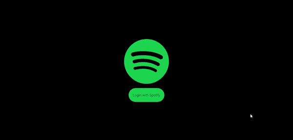

<h3 align="center">
    
</h3>

<p align="center"> 🎶 <strong>Clone Spotify with Next.JS and Tailwind.CSS</strong> </p>
 
<br>

## :pushpin: Índice

- [Sobre](#sobre-o-projeto)
- [Layout](#layout)
- [Tecnologias](#tecnologias)
- [Como Executar](#executar)
- [Deploy](#deploy)
- [Licença](#licenca)
- [Autor](#autor)
- [Agradecimentos](#agradecimento)

<br>

<a id="sobre-o-projeto"></a>

## 💻 Sobre o projeto

🎵 Clone da plataforma Spotify, desenvolvido utilizando Next.JS, Tailwind.CSS e a API do Spotify, para obter as playlists do usuário logado.

Baseado nas lives do canal de youtube [Sonny Sangha](https://www.youtube.com/c/SonnySangha/).

<br>

<a id="layout"></a>

## 🎨 Layout

<p align="center" style="display: flex; align-items: flex-start; justify-content: center;">
  
</p>

<br>

<a id="tecnologias"></a>

## 🛠 Tecnologias utilizadas

- [Reactjs](https://pt-br.reactjs.org)
- [Nextjs](https://nextjs.org)
- [Tailwind.css](https://tailwindcss.com/)
- [Vercel](https://vercel.com/)

<br>

<a id="executar"></a>

## 🚀 Como executar o projeto

Para utilizar a aplicação, você vai precisar ter instalado em sua máquina as seguintes ferramentas: [Git](https://git-scm.com), [Node.js](https://nodejs.org/en/) e, opcionalmente, **[Yarn](https://yarnpkg.com/)** para ter uma melhor experiência quando for executar a aplicação.
Além disto é bom ter um editor para trabalhar com o código como [VSCode](https://code.visualstudio.com/).

<br>

#### :octocat: Faça o clone do projeto

```bash
# Clone este repositório
$ git clone https://github.com/savio-2-lopes/Spotify-Clone-with-Next.js

# Acesse a pasta do projeto no terminal/cmd
$ cd Spotify-Clone-with-Next.js

```

<br>

#### 💻 Rodando a aplicação

```bash

# Instale as dependências
$ yarn install
# ou
$ npm install

# Execute a aplicação
$ yarn dev
# ou
$ npm dev
```

<br>

<a id="deploy"></a>

## :zap: Deploy

Para acessar o deploy hospedado no Vercel, segue o [link](https://spotify-clone-with-nextjs.vercel.app/)

<br>

<a id="licenca"></a>

## :memo: Licença

Todos os direitos de logotipo e imagens são da [Spotify](https://www.spotify.com/br/).
Este projeto está sob a licença do MIT. Veja a [página de licença](https://opensource.org/licenses/MIT) para mais detalhes.

<br>

<a id="autor"></a>

## 👨‍💻 Autor

[](https://github.com/savio-2-lopes)
[](https://www.instagram.com/savioaugulopes/)
[](https://www.linkedin.com/in/savio-lopes/)
[](mailto:savio.dev.lopes@gmail.com)

Feito com ❤️ por Savio Lopes 👋🏽 [Entre em contato!](https://www.linkedin.com/in/savio-lopes/)

<br>

<a id="agradecimento"></a>

## 💜 Agradecimentos

A aplicação foi baseado nas lives do Canal de [Sonny Sangha](https://www.youtube.com/c/SonnySangha/). Meus agradecimentos por disponibilizar estes conteúdos sensacionais 🚀.
